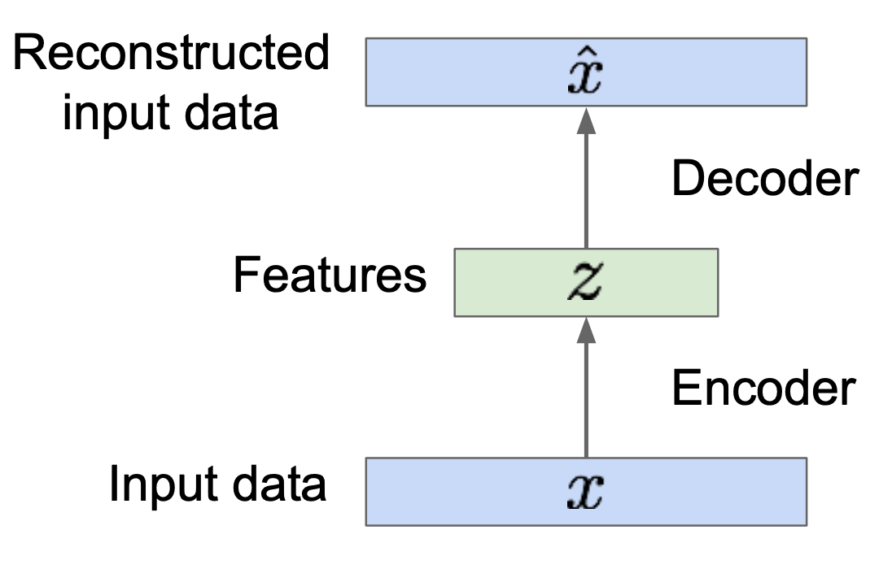
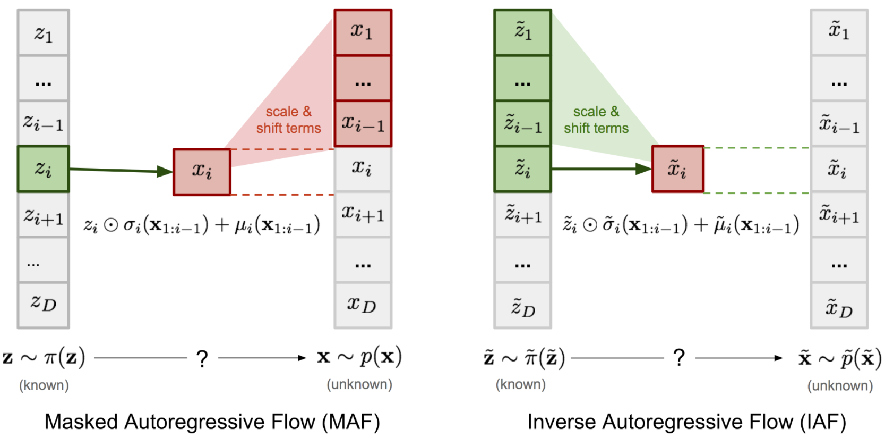

class: center, middle

# Flow-based Deep Generative Models

Jiarui Xu and Hao-Wen Dong

---

# Outlines

- __Deep generative models__
  - Different generative models
  - GAN vs VAE vs Flow-based models
- __Linear algebra basics__
  - Jacobian matrix and determinant
  - Change of variable theorem
- __Normalizing Flows__
  - NICE, RealNVP and Glow
- __Autoregressive Flows__
  - MAF and IAF

---

class: center, middle

# Deep Generative Models

---

# Different generative models

.footer[Ian Goodfellow, "Generative Adversarial Networks," _NeurIPS tutorial_, 2016.]

.center[]

???
On the left branch of this taxonomic tree, an explicit likelihood can be maximized by constructing an explicit density (e.g. VAE).

However, the density may be computationally be intractable in many cases.

On the right branch of the tree, the model does not explicitly represent a probability distribution over the space where the data lies (e.g. GAN).

Instead, the model provides some way of interacting less directly with data distribution.

In the following sections, Generative Adversarial Network (GAN), Variational Autoencoder (VAE) are briefly introduced and Flow based models are elaborated with more details.

---

# Generative Adversarial Networks (GANs)

.footer[Ian J. Goodfellow, Jean Pouget-Abadie, Mehdi Mirza, Bing Xu, David Warde-Farley, Sherjil Ozair, Aaron Courville, and Yoshua Bengio, "Generative Adversarial Nets," _NeurIPS_, 2014.]

???

Generative adversarial network (GAN) has shown great results in many generative tasks to replicate the real-world rich content such as images, human language, and music.

It is inspired by game theory: two models, a generator and a critic, are competing with each other while making each other stronger at the same time.

--

Components:

- A discriminator $D$ estimates the probability of a given sample coming from the real dataset.
- A generator $G$ outputs synthetic samples given a noise variable input.

???

- A discriminator $D$ estimates the probability of a given sample coming from the real dataset. It works as a critic and is optimized to tell the fake samples from the real ones.
- A generator $G$ outputs synthetic samples given a noise variable input. It is trained to capture the real data distribution so that its generative samples can be as real as possible, or in other words, can trick the discriminator to offer a high probability.

These two models compete against each other during the training process: the generator $G$ is trying hard to trick the discriminator, while the critic model $D$ is trying hard not to be cheated.

---

# Generative Adversarial Networks (GANs)

.footer[Ian J. Goodfellow, Jean Pouget-Abadie, Mehdi Mirza, Bing Xu, David Warde-Farley, Sherjil Ozair, Aaron Courville, and Yoshua Bengio, "Generative Adversarial Nets," _NeurIPS_, 2014.]

Define:

Generator $G$ with parameter `$\theta_g$`, Discriminator $D$ with parameter `$\theta_d$`.

Data distribution over noise input $z$: `$p_z(z)$` (usually uniform distribution)

Data distribution over real sample: `$p_\text{data}(x)$`

--

$D$ should distinguish between real and fake data:
`$$\max _{\theta_{d}}\left[\mathbb{E}_{x \sim p_{\text {data}}} \log D(x)+\mathbb{E}_{z \sim p(z)} \log \left(1-D\left(G(z)\right)\right)\right]$$`

--

$G$ should be able to fool discriminator:
`$$\min _{\theta_{g}}\mathbb{E}_{z \sim p(z)} \log \left(1-D\left(G(z)\right)\right)$$`

---

# Generative Adversarial Networks (GANs)

.footer[Ian J. Goodfellow, Jean Pouget-Abadie, Mehdi Mirza, Bing Xu, David Warde-Farley, Sherjil Ozair, Aaron Courville, and Yoshua Bengio, "Generative Adversarial Nets," _NeurIPS_, 2014.]

Define:

Generator $G$ with parameter `$\theta_g$`, Discriminator $D$ with parameter `$\theta_d$`.

Data distribution over noise input $z$: `$p_z(z)$` (usually uniform distribution)

Data distribution over real sample: `$p_\text{data}(x)$`

When combining two targets together, $G$ and $D$ are playing a __minimax game__:

`$$\min _{\theta_{g}}\max _{\theta_{d}}\left[\mathbb{E}_{x \sim p_{\text {data}}} \log D(x)+\mathbb{E}_{z \sim p(z)} \log \left(1-D\left(G(z)\right)\right)\right]$$`

---

# Generative Adversarial Networks (GANs)

.footer[AI Gharakhanian, "[Generative Adversarial Networks](https://www.kdnuggets.com/2017/01/generative-adversarial-networks-hot-topic-machine-learning.html)," _blog post_, 2017.]

.center[]

---

# Variational Autoencoders (VAEs)

## Some background: Autoencoders

.footer[Fei-Fei Li, Ranjay Krishna, and Danfei Xu, "[Lecture 11: Generative Models](http://cs231n.stanford.edu/slides/2020/lecture_11.pdf)," _lecture note_, Stanford CS231n, 2020.]

.absolute-right[]

- Autoencoders can reconstruct data,   and can learn features to initialize a  supervised model.

--

- Features capture factors of variation in   training data.

--

- But we can’t generate new images from   an autoencoder because we don’t know   the space of `$z$`.

--

- How do we make autoencoder a   generative model?

---

# Variational Autoencoders (VAEs)

.footer[Diederik P. Kingma and Max Welling, "Auto-Encoding Variational Bayes," _ICLR_, 2014.]

We sample a $z$ from a prior distribution `$p_\theta(z)$`.
Then $x$ is generated from a conditional distribution `$p_\theta(x \mid z)$`.
The process is
`$$p_{\theta}\left(\mathbf{x}\right)=\int p_{\theta}\left(\mathbf{x} \mid \mathbf{z}\right) p_{\theta}(\mathbf{z}) d \mathbf{z}$$`

--

However, it is very expensive to check all $z$ for integral (intractable).
To narrow down the value space, consider the posterior `$p_\theta(z \mid x)$` and approximate it by `$q_\phi(z\mid x)$`.

---

# Variational Autoencoders (VAEs)

.footer[Diederik P. Kingma and Max Welling, "Auto-Encoding Variational Bayes," _ICLR_, 2014.]

`\begin{align}
    &\log p_\theta(x)\\
    &=  \mathbf{E}_{z \sim q_{\phi}\left(z \mid x\right)}\left[\log p_{\theta}\left(x\right)\right] \\
    &=  \mathbf{E}_{z \sim q_{\phi}\left(z \mid x\right)}\left[\log \frac{p_{\theta}\left(x \mid z\right) p_{\theta}(z)}{p_{\theta}\left(z \mid x\right)}\right] \\
    &=  \mathbf{E}_{z \sim q_{\phi}\left(z \mid x\right)}\left[\log \frac{p_{\theta}\left(x \mid z\right) p_{\theta}(z)}{p_{\theta}\left(z \mid x\right)} \frac{q_{\phi}\left(z \mid x\right)}{q_{\phi}\left(z \mid x\right)}\right] \\
    &=  \mathbf{E}_{z \sim q_{\phi}\left(z \mid x\right)}\left[\log p_{\theta}\left(x \mid z\right)\right]-\mathbf{E}_{z \sim q_{\phi}\left(z \mid x\right)}\left[\log \frac{q_{\phi}\left(z \mid x\right)}{p_{\theta}(z)}\right]+\mathbf{E}_{z \sim q_{\phi}\left(z \mid x\right)}\left[\log \frac{q_{\phi}\left(z \mid x\right)}{p_{\theta}\left(z \mid x\right)}\right] \\
    &= \mathbb{E}_{z \sim q_\phi(z \mid x)}\left[\log p_{\theta}\left(x \mid z\right)\right]-D_{K L}\left(q_{\phi}\left(z \mid x\right) \| p_{\theta}(z)\right) + D_{K L}\left(q_{\phi}\left(z \mid x\right) \| p_{\theta}\left(z \mid x\right)\right)\\
    &\geq \mathbb{E}_{z \sim q_\phi(z \mid x)}\left[\log p_{\theta}\left(x \mid z\right)\right]-D_{K L}\left(q_{\phi}\left(z \mid x\right) \| p_{\theta}(z)\right)\\
    &= \text{ELBO}(x; \theta, \phi)
\end{align}`

???

- Bayes's Rule
- Multiply by constant
- Logarithm

1. Decoder network gives `$p_\theta(x \mid z)$`, can compute estimate of this term through sampling (need some trick to differentiate through sampling).
2. This KL term (between Gaussians for encoder and $z$ prior) has nice closed-form solution!
3. `$p_\theta(z \mid x)` intractable (saw earlier), can’t compute this KL term :( But we know KL divergence always >= 0.

---

# Variational Autoencoders (VAEs)

.footer[Diederik P. Kingma and Max Welling, "Auto-Encoding Variational Bayes," _ICLR_, 2014.]

We sample a $z$ from a prior distribution `$p_\theta(z)$`.
Then $x$ is generated from a conditional distribution `$p_\theta(x \mid z)$`.
The process is
`$$p_{\theta}\left(\mathbf{x}\right)=\int p_{\theta}\left(\mathbf{x} \mid \mathbf{z}\right) p_{\theta}(\mathbf{z}) d \mathbf{z}$$`

However, it is very expensive to check all $z$ for integral (intractable).
To narrow down the value space, consider the posterior `$p_\theta(z \mid x)$` and approximate it by `$q_\phi(z\mid x)$`.

--

The data likelihood

`$$\small \log p_\theta(x) = \mathbb{E}_{z \sim q_\phi(z \mid x)}\left[\log p_{\theta}\left(x \mid z\right)\right]-D_{K L}\left(q_{\phi}\left(z \mid x\right) \| p_{\theta}(z)\right) + D_{K L}\left(q_{\phi}\left(z \mid x\right) \| p_{\theta}\left(z \mid x\right)\right) \\ \geq \mathbb{E}_{z \sim q_\phi(z \mid x)}\left[\log p_{\theta}\left(x \mid z\right)\right]-D_{K L}\left(q_{\phi}\left(z \mid x\right) \| p_{\theta}(z)\right) = \text{ELBO}(x; \theta, \phi)$$`

--

`$\text{ELBO}(x; \theta, \phi)$` is tractable, `$\displaystyle \max_\theta \log p_\theta(x) \rightarrow \max_{\theta, \phi} \text{ELBO}(x; \theta, \phi)$`.

---

# Variational Autoencoders (VAEs)

.footer[Lilian Weng, "[From Autoencoder to Beta-VAE](https://lilianweng.github.io/lil-log/2018/08/12/from-autoencoder-to-beta-vae.html)," _blog post_, 2018.]

.center[]

---

# GANs vs VAEs vs Flow-based models

## Optimization target

--

### GAN:

`$$ \min _{\theta_{g}} \max _{\theta_{d}}\left[\mathbb{E}_{x \sim p_{\text {data}}} \log D_{\theta_{d}}(x)+\mathbb{E}_{z \sim p(z)} \log \left(1-D_{\theta_{d}}\left(G_{\theta_{g}}(z)\right)\right)\right] $$`

--

### VAE:

`$$\max _{\theta, \phi} \mathbb{E}_{z \sim q_\phi(z \mid x)}\left[\log p_{\theta}\left(x \mid z\right)\right]-D_{K L}\left(q_{\phi}\left(z \mid x\right) \| p_{\theta}(z)\right) \\= \text{ELBO}(x; \theta, \phi)$$`

--

### Flow-based generative models:

`$$\max _{\theta} \mathbb{E}_{x\sim p_{\text{data}}} \log p_\theta(x)$$`

---

# GANs vs VAEs vs Flow-based models

.footer[Lilian Weng, "[Flow-based Deep Generative Models](https://lilianweng.github.io/lil-log/2018/10/13/flow-based-deep-generative-models.html)," _blog post_, 2018.]

.center[]

???

Here is a quick summary of the difference between GAN, VAE, and flow-based generative models:

1. Generative adversarial networks: GAN provides a smart solution to model the data generation, an unsupervised learning problem, as a supervised one. The discriminator model learns to distinguish the real data from the fake samples that are produced by the generator model. Two models are trained as they are playing a [minimax](https://en.wikipedia.org/wiki/Minimax) game.
2. Variational autoencoders: VAE inexplicitly optimizes the log-likelihood of the data by maximizing the evidence lower bound (ELBO).
3. Flow-based generative models: A flow-based generative model is constructed by a sequence of invertible transformations. Unlike other two, the model explicitly learns the data distribution `$p(\mathbf{x})$` and therefore the loss function is simply the negative log-likelihood.

---

class: center, middle

# How to estimate data likelihood directly?

---

class: center, middle

# Linear Algebra Basics

---

# Jacobian matrix

Given a function $\mathbf{f}: \mathbb{R}^n \to \mathbb{R}^m$ that takes as input a $n$-dimensional input vector $\mathbf{x}$ and output a $m$-dimensional vector, the Jacobian matrix of $\mathbf{f}$ is defined as

`$$ \mathbf{J} = \begin{bmatrix} \frac{\partial f_1}{\partial x_1} & \frac{\partial f_1}{\partial x_2} & \dots & \frac{\partial f_1}{\partial x_n} \\ \frac{\partial f_2}{\partial x_1} & \frac{\partial f_2}{\partial x_2} & \dots & \frac{\partial f_2}{\partial x_n} \\ \vdots & \vdots & \vdots & \vdots \\ \frac{\partial f_m}{\partial x_1} & \frac{\partial f_m}{\partial x_2} & \dots & \frac{\partial f_m}{\partial x_n} \end{bmatrix}$$`

which is the matrix of all first-order partial derivatives. The entry on the $i$-th row and $j$-th column is $$\mathbf{J}_{ij} = \frac{\partial f_i}{\partial x_j}$$

---

# Change of variable theorem

Given some random variable $z \sim \pi(z)$ and a invertible mapping $x = f(z)$ (i.e., $z = f^{-1}(x) = g(x)$). Then, the distribution of $x$ is

$$p(x) = \pi(z) \left|\frac{dz}{dx}\right| = \pi(g(x)) \left|\frac{dg}{dx}\right|$$

--

The multivariate version takes the following form:

$$p(\mathbf{x}) = \pi(\mathbf{z}) \left|\det\frac{d\mathbf{z}}{d\mathbf{x}}\right| = \pi(g(\mathbf{x})) \left|\det\frac{dg}{d\mathbf{x}}\right|$$

where $\det\frac{dg}{d\mathbf{x}}$ is the _Jacobian determinant_ of $g$.

---

class: center, middle

# Normalizing Flows

---

# Normalizing flows

.footer[Lilian Weng, "[Flow-based Deep Generative Models](https://lilianweng.github.io/lil-log/2018/10/13/flow-based-deep-generative-models.html)," _blog post_, 2018.]

__Key__: Transform a simple distribution into a complex one by applying a sequence of _invertible transformations_.

.center[]

--

- In each step, substitute the variable with the new one by change of variables theorem.
- Eventually,  obtain a distribution close enough to the target distribution.

---

# Normalizing flows

.footer[Danilo Jimenez Rezende and Shakir Mohamed, "Variational Inference with Normalizing Flows," _ICML_, 2015.]

For each step, we have `$\mathbf{z}_i \sim p_i(\mathbf{z}_i)$`, `$\mathbf{z}_i = f_i(\mathbf{z}_{i-1})$` and `$\mathbf{z}_{i-1} = g_i(\mathbf{z}_i)$`. Now,

`$$\begin{align}
  p_i(\mathbf{z}_i)
  &= p_{i-1}(g_i(\mathbf{z}_i)) \left|\det\frac{dg_i(\mathbf{z}_i)}{d\mathbf{z}_i}\right| &&\text{(by change of variables theorem)}\\
  &=p_{i-1}(\mathbf{z}_{i-1})\left|\det\frac{d\mathbf{z}_{i-1}}{df_i(\mathbf{z}_{i-1})}\right| &&\text{(by definition)}\\
  &=p_{i-1}(\mathbf{z}_{i-1})\left|\det\left(\frac{df_i(\mathbf{z}_{i-1})}{d\mathbf{z}_{i-1}}\right)^{-1}\right| &&\text{(by inverse function theorem)}\\
  &=p_{i-1}(\mathbf{z}_{i-1})\left|\det\frac{df_i}{d\mathbf{z}_{i-1}}\right|^{-1} &&\text{(by $\det M \det (M^{-1}) = \det I = 1$)}
\end{align}$$`

Thus, we have `$\log p_i(\mathbf{z}_i) = \log p_{i-1}(\mathbf{z}_{i-1}) - \log \left|\det\frac{df_i}{d\mathbf{z}_{i-1}}\right|$`.

---

# Normalizing flows

.footer[Danilo Jimenez Rezende and Shakir Mohamed, "Variational Inference with Normalizing Flows," _ICML_, 2015.]

Now, we obtain `$\log p_i(\mathbf{z}_i) = \log p_{i-1}(\mathbf{z}_{i-1}) - \log \left|\det\frac{df_i}{d\mathbf{z}_{i-1}}\right|$`

Recall that `$\mathbf{x} = \mathbf{z}_K = f_K \circ f_{K-1} \dots f_1 (\mathbf{z_0})$`.

Thus, we have

`$$\begin{align}
  \log p(\mathbf{x})
  &= \log p_K(\mathbf{z}_K)\\
  &= \log p_{K-1}(\mathbf{z}_{K-1}) - \log\left|\det\frac{df_K}{d\mathbf{z}_{K-1}}\right|\\
  &=\dots\\
  &= \log p_0(\mathbf{z}_0) - \sum_{i=1}^K \log\left|\det\frac{df_i}{d\mathbf{z}_{i-1}}\right|
\end{align}$$`

---

# Normalizing flows

.footer[Danilo Jimenez Rezende and Shakir Mohamed, "Variational Inference with Normalizing Flows," _ICML_, 2015.]

In normalizing flows, the exact log-likelihood $\log p(\mathbf{x})$ of input data $x$ is

`$$\log p(\mathbf{x}) = \log p_0(\mathbf{z}_0) - \sum_{i=1}^K \log\left|\det\frac{df_i}{d\mathbf{z}_{i-1}}\right|$$`

--

To make the computation tractable, it requires

- $f_i$ is easily invertible
- The Jacobian determinant of $f_i$ is easy to compute

--

Then, we can train the model by maximizing the log-likelihood over some training dataset $\mathcal{D}$

$$LL(\mathcal{D}) = \sum_{\mathbf{x}\in\mathcal{D}} \log p(\mathbf{x})$$

---

# NICE

.footer[Laurent Dinh, David Krueger, and Yoshua Bengio, "NICE: Non-linear Independent Components Estimation," _ICLR_, 2015.]

The core idea behind NICE (Non-linear Independent Components Estimation) is to

1. split $\mathbf{x} \in \mathbb{R}^D$ into two blocks $\mathbf{x}_1 \in \mathbb{R}^d$ and $\mathbf{x}_2 \in \mathbb{R}^{D-d}$

--

2. apply the following transformation from $(\mathbf{x}_1, \mathbf{x}_2)$ to $(\mathbf{y}_1, \mathbf{y}_2)$

  `$$\begin{cases}
    \mathbf{y}_1 &= \mathbf{x}_1\\
    \mathbf{y}_2 &= \mathbf{x}_2 + m(\mathbf{x}_1)
  \end{cases}$$`

  where $m(\cdot)$ is an arbitrarily function (e.g., a deep neural network).

---

# NICE - Additive coupling layers

.footer[Laurent Dinh, David Krueger, and Yoshua Bengio, "NICE: Non-linear Independent Components Estimation," _ICLR_, 2015.]

The transformation

`$$\begin{cases}
  \mathbf{y}_1 &= \mathbf{x}_1\\
  \mathbf{y}_2 &= \mathbf{x}_2 + m(\mathbf{x}_1)
\end{cases}$$`

- is trivially invertible.

  `$$\begin{cases}
    \mathbf{x}_1 &= \mathbf{y}_1\\
    \mathbf{x}_2 &= \mathbf{y}_2 - m(\mathbf{y}_1)
  \end{cases}$$`

---

# NICE - Additive coupling layers

.footer[Laurent Dinh, David Krueger, and Yoshua Bengio, "NICE: Non-linear Independent Components Estimation," _ICLR_, 2015.]

The transformation

`$$\begin{cases}
  \mathbf{y}_1 &= \mathbf{x}_1\\
  \mathbf{y}_2 &= \mathbf{x}_2 + m(\mathbf{x}_1)
\end{cases}$$`

- has a unit Jacobian determinant.

  `$$\mathbf{J} = \begin{bmatrix}\mathbf{I}_d&\mathbf{0}_{d\times(D-d)}\\\frac{\partial m(\mathbf{x}_1)}{\partial\mathbf{x}_1}&\mathbf{I}_{D-d}\end{bmatrix}$$`

  `$$\det(\mathbf{J}) = \mathbf{I}$$`

  Note that NICE is a type of _volume-preserving flows_ as it has a unit Jacobian determinant.

---

# NICE - Alternating pattern

.footer[Laurent Dinh, David Krueger, and Yoshua Bengio, "NICE: Non-linear Independent Components Estimation," _ICLR_, 2015. Laurent Dinh, Jascha Sohl-Dickstein, and Samy Bengio, "Density Estimation using Real NVP," _ICLR_, 2017.]

Some dimensions remain unchanged after the transform

- alternate the dimensions being modified
- 3 coupling layers are necessary to allow all dimensions to influence one another

.center[]

---

# NICE - Experiments on MNIST

__Settings__: 764 dimensions (28$\times$28), 6 additive coupling layers

.center[]

---

# RealNVP

.footer[Laurent Dinh, Jascha Sohl-Dickstein, and Samy Bengio, "Density Estimation using Real NVP," _ICLR_, 2017.]

The core idea behind RealNVP (Real-valued Non-Volume Preserving) is to

1. split $\mathbf{x} \in \mathbb{R}^D$ into two blocks $\mathbf{x}_1 \in \mathbb{R}^d$ and $\mathbf{x}_2 \in \mathbb{R}^{D-d}$

--

2. apply the following transformation from $(\mathbf{x}_1, \mathbf{x}_2)$ to $(\mathbf{y}_1, \mathbf{y}_2)$

  `$$\begin{cases}
    \mathbf{y}_{1:d} &= \mathbf{x}_{1:d}\\
    \mathbf{y}_{d+1:D} &= \mathbf{x}_{d+1:D} \odot e^{s(\mathbf{x}_{1:d})} + t(\mathbf{x}_{1:d})
  \end{cases}$$`

  where $s(\cdot)$ and $t(\cdot)$ are _scale_ and _translation_ functions that map $\mathbb{R}^d$ to $\mathbb{R}^{D-d}$, and $\odot$ denotes the element-wise product.

--

  (Note that NICE does not have the scaling term.)

---

# RealNVP - Affine coupling layers

.footer[Laurent Dinh, Jascha Sohl-Dickstein, and Samy Bengio, "Density Estimation using Real NVP," _ICLR_, 2017.]

The transformation

`$$\begin{cases}
  \mathbf{y}_{1:d} &= \mathbf{x}_{1:d}\\
  \mathbf{y}_{d+1:D} &= \mathbf{x}_{d+1:D} \odot e^{s(\mathbf{x}_{1:d})} + t(\mathbf{x}_{1:d})
\end{cases}$$`

- is easily invertible.

  `$$\begin{cases}
    \mathbf{x}_{1:d} &= \mathbf{y}_{1:d}\\
    \mathbf{x}_{d+1:D} &= (\mathbf{y}_{d+1:D} - t(\mathbf{x}_{1:d})) \odot e^{-s(\mathbf{x}_{1:d})}
  \end{cases}$$`

  (Note that it does not involve computing $s^{-1}$ and $t^{-1}$.)

---

# RealNVP - Affine coupling layers

.footer[Laurent Dinh, Jascha Sohl-Dickstein, and Samy Bengio, "Density Estimation using Real NVP," _ICLR_, 2017.]

The transformation

`$$\begin{cases}
  \mathbf{y}_{1:d} &= \mathbf{x}_{1:d}\\
  \mathbf{y}_{d+1:D} &= \mathbf{x}_{d+1:D} \odot e^{s(\mathbf{x}_{1:d})} + t(\mathbf{x}_{1:d})
\end{cases}$$`

- has a Jacobian determinant that is easy to compute.

  `$$\mathbf{J} = \begin{bmatrix}\mathbf{I}_d&\mathbf{0}_{d\times(D-d)}\\\frac{\partial\mathbf{y}_{d+1:D}}{\partial\mathbf{x}_{1:d}}&\text{diag}\left(e^{s(\mathbf{x}_{1:d})}\right)\end{bmatrix}$$`

  `$$\det(\mathbf{J}) = \prod_{j=1}^{D-d} e^{s(\mathbf{x}_{1:d})_j} = \exp\left(\sum_{j=1}^{D-d}s(\mathbf{x}_{1:d})_j\right)$$`

  (Note that it does not involve computing the Jacobian of $s$ and $t$.)

---

# RealNVP - Experiments on toy data

__Settings__: 2D data, 5 affine coupling layers

.center[]

---

# RealNVP - Experiments on toy data

__Settings__: 2D data, 5 affine coupling layers

.center[]

---

# RealNVP - Experiments on MNIST

__Settings__: 764 dimensions (28$\times$28), 5 affine coupling layers

.center[]

---

# Glow

.footer[Diederik P. Kingma and Prafulla Dhariwal, "Glow: Generative Flow with Invertible 1$\times$1 Convolutions," _NeurIPS_, 2018]

.absolute-right[]

- Actnorm:

  - Forward: $\mathbf{y} = \mathbf{s} \odot \mathbf{x} + \mathbf{b}$
  - Backward: $\mathbf{x} = \mathbf{s} \odot (\mathbf{y} - \mathbf{b)}$
  - Log-determinant: $h \cdot w \cdot \sum_i\log|\mathbf{s}_i|$

--

- Invertible 1$\times$1 convolution:

  - Forward: $\mathbf{y} = \mathbf{W} \mathbf{x}$
  - Backward: $\mathbf{x} = \mathbf{W}^{-1} \mathbf{y}$
  - Log-determinant: $h \cdot w \cdot \log|\det \mathbf{W}|$

--

- Affine coupling Layer: same as RealNVP

---

# Glow - Samples

.footer[Diederik P. Kingma and Prafulla Dhariwal, "Glow: Generative Flow with Invertible 1$\times$1 Convolutions," _NeurIPS_, 2018]

.center[]

---

class: center, middle

# Autoregressive Flows

---

# Autoregressive flows

.footer[Lilian Weng, "[Flow-based Deep Generative Models](https://lilianweng.github.io/lil-log/2018/10/13/flow-based-deep-generative-models.html)," _blog post_, 2018.]

__Key__: Model the transformation in a normalizing flow as an _autoregressive model_.

In an autoregressive model, we assume that _the current output depends only on the data observed in the past_ and factorize the joint probability `$p(x_1, x_2, \dots, x_D)$` into the product of the probability of observing `$x_i$` conditioned on the past observations `$x_1, x_2, \dots, x_{i-1}$`.

`$$\begin{align}
  p(\mathbf{x}) &= p(x_1, x_2, \dots, x_D)\\
  &= p(x_1)\,p(x_2|x_1)\,p(x_3|x_1, x_2)\,\dots\,p(x_D|x_1, x_2, \dots, x_{D-1})\\
  &= \prod_{i=1}^D p(x_i|x_1, x_2, \dots, x_{i-1})\\
  &= \prod_{i=1}^D p(x_i|\mathbf{x}_{1:i-1})
\end{align}$$`

---

# Masked autoregressive flow (MAF)

.footer[George Papamakarios, Theo Pavlakou, and Iain Murray, "Masked Autoregressive Flow for Density Estimation," _NeurIPS_, 2017. Mathieu Germain, Karol Gregor, Iain Murray, and Hugo Larochelle, "MADE: Masked Autoencoder for Distribution Estimation," _ICML_, 2015.]

Given two random variables $\mathbf{z} \sim \pi(\mathbf{z})$ and $\mathbf{x} \sim p(\mathbf{x})$ where $\pi(\mathbf{z})$ is known but $p(\mathbf{x})$ is unknown. Masked autoregressive flow (MAF) aims to learn $p(x)$.

- Sampling:

  `$$x_i \sim p(x_i|\mathbf{x}_{1:i-1}) = z_i \odot \sigma_i(\mathbf{x}_{1:i-1}) + \mu_i(\mathbf{x}_{1:i-1})$$`

  Note that this computation is slow as it is sequential and autoregressive.

--

- Density estimation:

  `$$p(\mathbf{x}) = \prod_{i=1}^D p(x_i|\mathbf{x}_{1:i-1})$$`

  Note that this computation can be fast if we use the _masking_ approach introduced in MADE as it only requires one single pass to the network.

---

# Inverse autoregressive flow (IAF)

.footer[Diederik P. Kingma, Tim Salimans, Rafal Jozefowicz, Xi Chen, Ilya Sutskever, and Max Welling, "Improved Variational Inference with Inverse Autoregressive Flow," _NeurIPS_, 2016.]

In MAF, we have `$x_i = z_i \odot \sigma_i(\mathbf{x}_{1:i-1}) + \mu_i(\mathbf{x}_{1:i-1})$`. We can reverse it into

`$$z_i = x_i \odot \frac{1}{\sigma_i(\mathbf{x}_{1:i-1})} - \frac{\mu_i(\mathbf{x}_{1:i-1})}{\sigma_i(\mathbf{x}_{1:i-1})}$$`

Now, if we swap $\mathbf{x}$ and $\mathbf{z}$ (let $\tilde{\mathbf{z}} = \mathbf{x}$ and $\tilde{\mathbf{x}} = \mathbf{z}$), we get the inverse autoregressive flow (IAF)

`$$\begin{align}
  \tilde{x}_i &= \tilde{z}_i \odot \frac{1}{\sigma_i(\tilde{\mathbf{z}}_{1:i-1})} - \frac{\mu_i(\tilde{\mathbf{z}}_{1:i-1})}{\sigma_i(\tilde{\mathbf{z}}_{1:i-1})}\\
  &= \tilde{z}_i \odot \tilde{\sigma}_i(\tilde{\mathbf{z}}_{1:i-1}) + \tilde{\mu}_i(\tilde{\mathbf{z}}_{1:i-1})
\end{align}$$`

where

`$$\tilde{\sigma}_i(\tilde{\mathbf{z}}_{1:i-1}) = \frac{1}{\sigma_i(\tilde{\mathbf{z}}_{1:i-1})}, \quad \tilde{\mu}_i(\tilde{\mathbf{z}}_{1:i-1}) = -\frac{\mu_i(\tilde{\mathbf{z}}_{1:i-1})}{\sigma_i(\tilde{\mathbf{z}}_{1:i-1})}$$`

---

# MAF vs IAF

.footer[Lilian Weng, "[Flow-based Deep Generative Models](https://lilianweng.github.io/lil-log/2018/10/13/flow-based-deep-generative-models.html)," _blog post_, 2018.]

.center[]

.center[(Note that $\tilde{\mathbf{z}} = \mathbf{x}$, $\tilde{\mathbf{x}} = \mathbf{z}$, $\tilde{\pi} = p$ and $\tilde{p} = \pi$.)]

---

# MAF vs IAF

.footer[Lilian Weng, "[Flow-based Deep Generative Models](https://lilianweng.github.io/lil-log/2018/10/13/flow-based-deep-generative-models.html)," _blog post_, 2018.]

|                        | MAF                | IAF                |
|------------------------|:------------------:|:------------------:|
| __Base distribution__   | $\mathbf{z}\sim\pi(\mathbf{z})$ | $\mathbf{x}\sim p(\mathbf{x})$ |
| __Target distribution__ | $\tilde{\mathbf{z}}\sim\tilde{\pi}(\tilde{\mathbf{z}})$ | $\tilde{\mathbf{x}}\sim \tilde{p}(\tilde{\mathbf{x}})$ |
| __Model__              | `$\small x_i = z_i \odot \sigma_i(\mathbf{x}_{1:i-1}) + \mu_i(\mathbf{x}_{1:i-1})$` | `$\small \tilde{x}_i = \tilde{z}_i \odot \tilde{\sigma}_i(\tilde{\mathbf{z}}_{1:i-1}) + \tilde{\mu}_i(\tilde{\mathbf{z}}_{1:i-1})$` |
| __Sampling__           | slow (sequential)  | fast (single pass) |
| __Density estimation__ | fast (single pass) | slow (sequential)  |

---

class: center, middle

# Summary

---

# Summary

- Compare different generative models
  - GANs, VAEs and flow-based models
- Survey different normalizing flow models
  - NICE, RealNVP, Glow, MAF and IAF
- Conduct experiments on generating MNIST handwritten digits
  - NICE and RealNVP

---

class: center, middle

# Thank you!

[Code] <https://github.com/salu133445/flows>

[Slides] <https://salu133445.github.io/flows>
